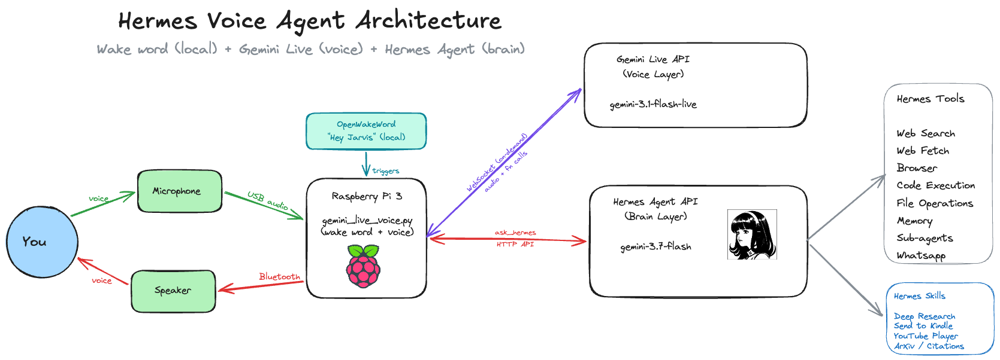
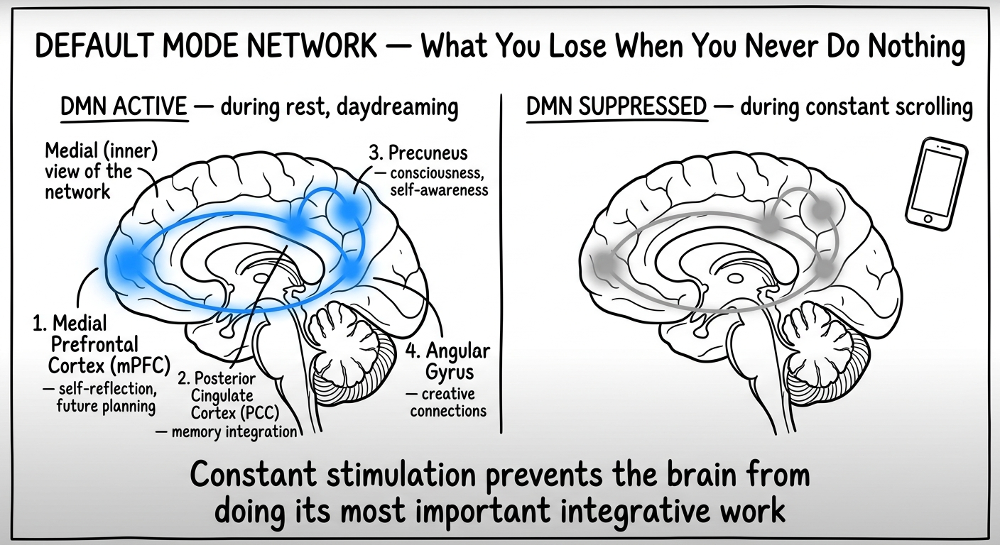

# Going Screenless Using AI

An experiment in minimizing screen time by replacing phone-based workflows with a voice-controlled AI agent running on a Raspberry Pi.



## Architecture

```
[You] ──voice──▶ [Shure MV7 USB Mic] ──▶ [Pi running voice agent]
                                                │
                                    ┌───────────┴───────────┐
                                    │                       │
                              [Gemini Live API]      [Hermes Agent API]
                              (native audio I/O)     (brain + tools)
                              via WebSocket           │
                                    │          ┌──────┼──────┐
                                    │          │      │      │
                                    │     [Web Search] [Memory] [Skills]
                                    │          │      │      │
                              [3.5mm jack] [Kindle] [WhatsApp] [Code Exec]
                                    │     (email)  (bridge)
                              [Bose Speaker]
                                    │
                              [You] ◀──voice──
```

### Hardware
| Component | Role |
|-----------|------|
| Raspberry Pi 3 | Always-on host for the voice agent |
| Shure MV7 (USB) | Microphone input |
| Bose Speaker (3.5mm) | Audio output |

### Software Stack
| Layer | Technology |
|-------|------------|
| Wake word | OpenWakeWord (local ONNX inference, zero cost) |
| Voice I/O | Gemini Live API (native audio WebSocket, ~300ms latency) |
| Brain / Tools | Hermes Agent (web search, code execution, memory, skills) |
| Audio system | PipeWire with pipewire-alsa bridge |
| Process management | systemd user services with linger |

### Key Design Decisions

- **Wake word → connect on demand**: Gemini Live WebSocket only opens after hearing "Hey Jarvis." Auto-disconnects after idle timeout. This eliminates idle billing entirely.
- **Hybrid architecture**: Gemini Live handles conversational voice directly. Tool-based tasks (research, messaging, media) are delegated to Hermes Agent via function calling.
- **Fire-and-forget pattern**: Tasks that deliver results elsewhere (Kindle, email) return instantly with confirmation. Tasks where the user needs the answer spoken back wait for the result.
- **Single-turn tool calls**: Speech acknowledgment and tool call happen in the same Gemini turn. Splitting them across turns causes the tool call to silently fail (see [Lessons Learned](#lessons-learned)).

### Voice Loop Lifecycle

1. **Idle**: OpenWakeWord listens locally (zero network cost)
2. **Wake**: "Hey Jarvis" detected → 880Hz ready beep → Gemini Live WebSocket opens
3. **Conversation**: Audio streams bidirectionally. Gemini handles casual chat directly
4. **Tool call**: User asks for something requiring tools → Gemini calls `ask_hermes` → Hermes Agent executes → result spoken back (or delivered to Kindle/WhatsApp)
5. **Idle timeout**: No activity for N seconds → WebSocket closes → back to wake word listening

### Capabilities

| Workflow | How it works |
|----------|-------------|
| **Deep Research → Kindle** | "Research [topic] and send to Kindle" → Hermes does multi-source web research → sends formatted report as HTML attachment to Kindle email |
| **YouTube Audio** | "Play my workout playlist" → local playlist index lookup → yt-dlp + mpv audio-only playback through speaker |
| **WhatsApp** | "What's new on WhatsApp?" → Hermes reads messages via Baileys bridge → speaks summary back |
| **General Q&A** | "What's the weather?" → Gemini answers directly, no tool call needed |

## Sample Code

See the [samples/](samples/) directory for sanitized reference implementations:

- **[voice_agent_sample.py](samples/voice_agent_sample.py)** — Skeleton of the wake word + Gemini Live + agent integration pattern
- **[deploy_sample.sh](samples/deploy_sample.sh)** — Example deployment script structure for Pi-based voice agents

These are simplified reference implementations showing the architecture patterns. They are not the full production scripts.

## Lessons Learned

### Voice Architecture
- The **STT → LLM → TTS pipeline** will always have multi-second latency, even with streaming overlap. For Google Home-like UX, native audio models (Gemini Live, OpenAI Realtime) are the only viable path.
- Gemini Live expects **16kHz input** and sends **24kHz output** — mismatched sample rates cause garbled audio.
- Per-chunk `sd.play()` creates **choppy audio**. Use a continuous `sd.OutputStream` with a ring buffer callback for smooth playback.

### Gemini Live Specifics
- **Speech and tool calls must happen in the SAME turn.** Telling the model to "speak first, then call the tool" causes the speech to complete the turn, and the tool call never fires. Always instruct: "acknowledge AND call the tool together in the same response."
- **Compound requests** ("do X and also Y") should be combined into a single tool call — multiple sequential tool calls are unreliable in audio mode.
- Gemini Live rejects connections with **1008** if audio is sent before setup is acknowledged — gate audio streaming on `setupComplete`.
- Sessions have a **10-minute max** — production deployments need reconnection logic.

### Raspberry Pi
- Pi 3 with **1GB RAM** runs the voice agent fine, but browser-based tools (Chromium) won't fit.
- **PipeWire + pipewire-alsa** bridge is required for PortAudio/sounddevice compatibility on modern Raspberry Pi OS.
- Wake word detection with OpenWakeWord uses **ONNX runtime** (tflite is incompatible with NumPy 2.x on Pi).

### Kindle Integration
- Amazon Kindle rejects email where content is in the body — must be a **file attachment** with subject "convert".

---

## Why?

> Every now and then, I think we all need to do a project purely for the sake of it. No outcome, no ROI—just because you can.

There's actual science behind why going screenless matters. When you eliminate screens and let your brain experience boredom, you activate the **Default Mode Network (DMN)**. That idle state is critical for forming deep neural connections and creative problem-solving. Breaking screen addiction is brutally hard, which is why I needed a systemic approach rather than pure willpower.

More on the science: [Brain & Consumption Impact](https://ranand12.github.io/brain-consumption-impact/)



## What Didn't Work

I tried all the usual tricks:
- Turning my phone screen to **grayscale + assistive access**
- Locking the phone in a **physical box** (ySky)
- **NFC Tags** to screen-lock ([Foqos](https://www.foqos.app/))
- Moving the TV to the basement so watching requires a deliberate trek

Each helped to some extent, but the pull of the screen is too strong when almost every daily workflow runs through it. So the plan became: swap my daily workflows for a **pure audio interface**.

When I really thought about it, my phone usage came down to three things: **YouTube**, **WhatsApp**, and **reading articles on Safari** (the 80%). I never actually liked reading on a screen — I much prefer my Kindle. So the question became: what if I could handle my personal tech usage with minimal screen time?

## Why Hermes Agent?

The honest answer: I'd been wanting to try it out, and this was the perfect excuse. What specifically attracted me:

- **Built-in learning loop** — the agent self-improves over time, so after a month the responses get measurably different
- **Skill system** — extensible with custom skills (deep research, YouTube, Kindle delivery)
- **Multiple gateways** — API server, CLI, WhatsApp, desktop — flexible for a personal assistant
- **Context and memory** — it remembers past conversations and builds on them

More details: [Hermes Agent Docs](https://hermes-agent.nousresearch.com/docs/)

## Disclaimer

I will strictly **not recommend** trying this in an enterprise or production scenario. This is good for personal experimentation only. Running an agent like Hermes requires proper security considerations — the self-improving skills sound impressive, but an agent that writes its own procedures [needs human review](https://www.clawbot.blog/blog/hermes-agent-framework-self-aware-ai-agents-that-improve-without-you/) before those procedures run in anything serious.

## A Word of Caution

If you think this is totally absurd, I completely understand. But hey, at least you stuck with me to the end and I appreciate that :)

---

*If you're interested in the brain science behind screen time and the Default Mode Network, check out: [Brain & Consumption Impact](https://ranand12.github.io/brain-consumption-impact/)*
